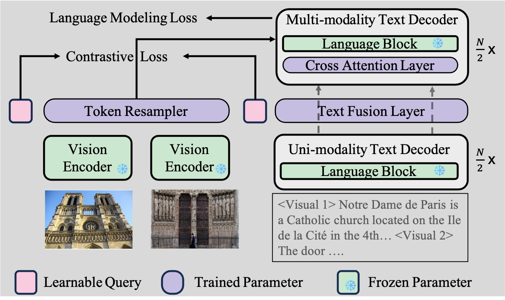
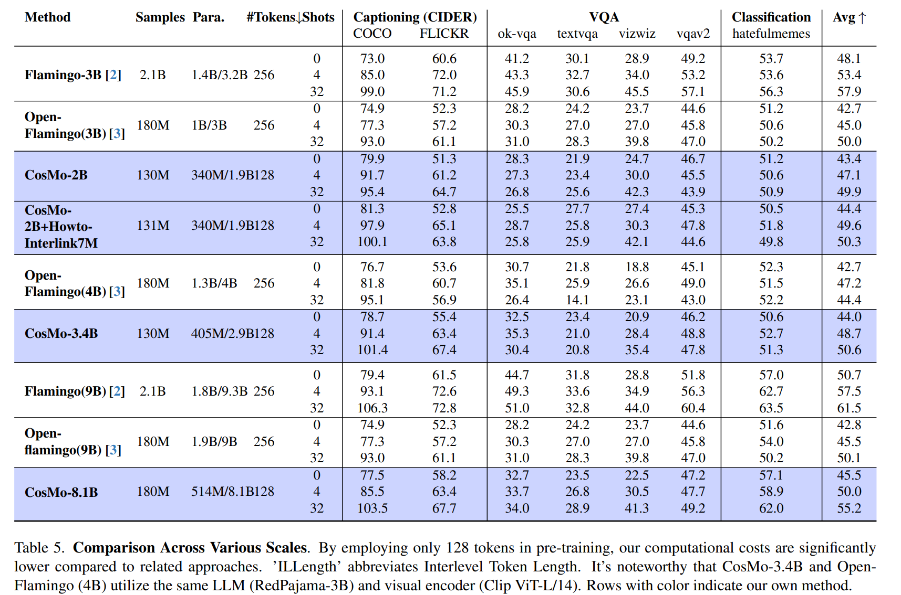

 

# CosMo

[Paper Link](https://arxiv.org/pdf/2401.00849.pdf),
[Model Link](https://huggingface.co/Awiny),
[Dataset Link](https://huggingface.co/datasets/Awiny/Howto-Interlink7M),
[COSMOE LINK](https://fingerrec.github.io/cosmoe)


- <p style="color: pink;">Cosmo, a fully open-source and comprehensive interleaved pre-training framework, is meticulously crafted for image and video processing.</p>
Its primary focus lies on In-context Learning.




## News
- 2/April/2024. The code support trained on MOE (Mixtral 8x7b) model now. See [CosMOE Website](https://fingerrec.github.io/cosmoe) for details.
- 2/Jan/2024. We provide  the preprocess scripts to prepare the pre-training/downstream dataset.
- 2/Jan/2024. We release Howto-Interlink7M dataset. See [Huggingface List View](https://huggingface.co/datasets/Awiny/Howto-Interlink7M) for details.


## Functionality of This Code
- Provides an Interleaved Image/Video Dataloader.
- Integration with Webdataset.
- Utilizes Huggingface Transformers along with Deepspeed for training.
- Incorporates contrastive loss.
- Enables few-shot evaluation.
- Supports instruction tuning.
- Scaline from 2B model to 56B.


## Model Card




See [MODEL_CARD.md](MODEL_CARD.md) for more details.


## HowToInterlink7M Dataset
See [HowToInterlink7M.md](HowToInterlink7M.md).

## Install
See [INSTALL.md](INSTALL.md).

## Dataset Preparation
See [DATASET.md](DATASET.md).


## Pre-training
See [PRETRAIN.md](PRETRAIN.md).


## Pre-training Cos-MOE(56B)

### Prepare LLM
Since MOE checkpoint is larger than 200GB which is time consuming to download.
So it's best to pre-cache in a local directory with tools like AZCopy.

```
mkdir /tmp/pretrained_models
cd /tmp/pretrained_models
git clone https://huggingface.co/mistralai/Mixtral-8x7B-v0.1
```

### Train
To reduce GPU memory usage during MOE training, we employ 4-bit training. Ensure 'bitsandbytes' is installed beforehand.

```
pip install requirements_mistral.txt
```

```shell
python src/main_pretrain.py --base_config src/config/train_server/base_180m.yaml --variant_config src/config/train_server/mixtral/ base.yaml --deepspeed src/config/deepspeed/deepspeed_config_mixtral_8x7b.json
```


## Few-shot Evaluation without Tuning

This code support 44 downstream datasets.
Include but not limited to COCO, FLICKR30K, OK-VQA, TextVQA, VizWiz, VQAV2, Hatefulmemes, Vatex, TGIF, MSVD, MSRVTT.

See [Evaluation.md](EVALUATION.md)

## Instruction Tuning
See [TUNING.md](TUNING.md)


## Citation

If you find our work helps, please consider cite the following work

```
@article{wang2024cosmo,
  title={COSMO: Contrastive Streamlined Multimodal Model with Interleaved Pre-Training},
  author={Wang, Alex Jinpeng and Li, Linjie and Lin, Kevin Qinghong and Wang Jianfeng and Lin, Kevin and Yang, Zhengyuan  and Wang, Lijuan and Shou, Mike Zheng},
  journal={arXiv preprint arXiv:2401.00849},
  year={2024}
}
```


## Contact
Email: awinyimgprocess at gmail dot com


## Acknowledgement
Our work are mainly based on the following works:

[MMC4](https://github.com/allenai/mmc4),[Open-flamingo](https://github.com/mlfoundations/open_flamingo), [Open-CLIP](https://github.com/mlfoundations/open_clip), [Huggingface Transformer](https://github.com/huggingface/transformers/blob/main/src/transformers/trainer.py) and [WebDataset](https://github.com/webdataset/webdataset).