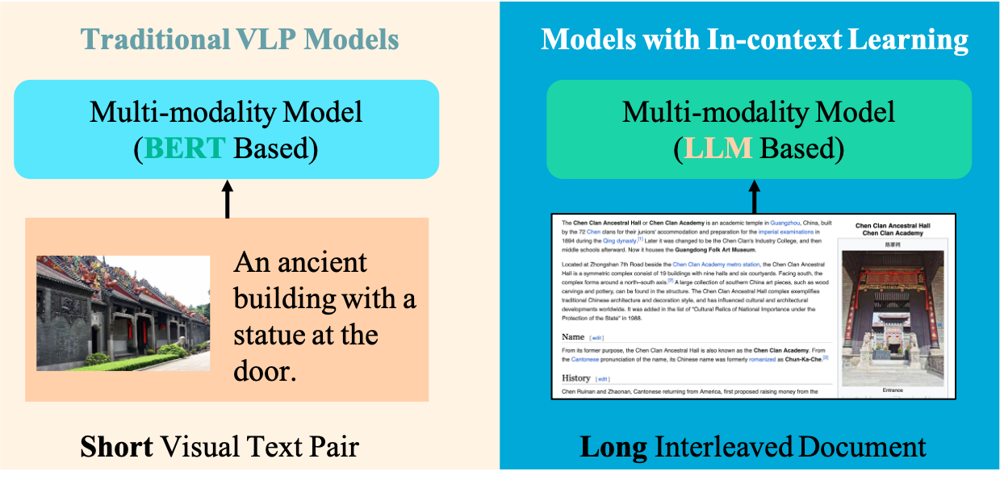

 CosMo

[Paper Link](https://arxiv.org/pdf/2401.00849.pdf),
[Model Link](),
[Dataset Link]()




- <p style="color: pink;">Cosmo, a fully open-source and comprehensive pre-training framework, is meticulously crafted for image and video processing.</p>
Its primary focus lies on In-context Learning.


## Functionality of This Code
- Provides an Interleaved Image/Video Dataloader.
- Integration with Webdataset.
- Utilizes Huggingface Transformers along with Deepspeed for training.
- Incorporates contrastive loss.
- Enables few-shot evaluation.
- Supports instruction tuning.


## Model Card
See [MODEL_CARD.md](MODEL_CARD.md).


## HowToInterlink7M Dataset
See [HowToInterlink7M.md](HowToInterlink7M.md).

## Install
See [INSTALL.md](INSTALL.md).

## Dataset Preparation
See [DATASET.md](DATASET.md).


## Pre-training
See [PRETRAIN.md](PRETRAIN.md).

## Few-shot Evaluation without Tuning
See [Evaluation.md](EVALUATION.md)

## Instruction Tuning
See [TUNING.md](TUNING.md)


## Citation

If you find our work helps, please consider cite the following work

```
@article{wang2024cosmo,
  title={COSMO: Contrastive Streamlined Multimodal Model with Interleaved Pre-Training},
  author={Wang, Alex Jinpeng and Li, Linjie and Lin, Kevin Qinhong and Wang Jianfeng and Lin, Kevin and Yang, Zhengyuan  and Wang, Lijuan and Shou, Mike Zheng},
  journal={arXiv preprint arXiv:2401.00849},
  year={2024}
}
```


## Contact
Email: awinyimgprocess at gmail dot com


## Acknowledgement
Our work are mainly based on the following works:

[MMC4](https://github.com/allenai/mmc4),[Open-flamingo](https://github.com/mlfoundations/open_flamingo), [Open-CLIP](https://github.com/mlfoundations/open_clip), [Huggingface Transformer](https://github.com/huggingface/transformers/blob/main/src/transformers/trainer.py) and [WebDataset](https://github.com/webdataset/webdataset).